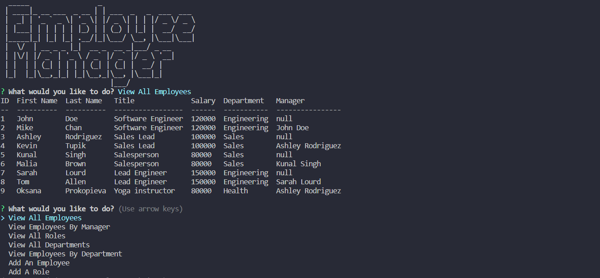

## 🗂️EmployeeTracker

## Description
📌Interface that allow non-developers to easily view and interact with information stored in databases.

## Installation
🖇️Try in your VS Code, open terminal and first type - npm i. To run - npm start.

## Usage
⌨️Command-line application to manage a company's employee database, using Node.js, Inquirer, and MySQL.

## License
Please refer to the LICENSE in the repo.

## Contributing
🤝Contributors welcome for code improvement.

## EmployeeTracker View

## Questions
If you have any questions find me on [GitHub](https://github.com/oprokopieva382) or feel free email me oprokopieva382@gmail.com

## Links
Check out the walkthrough video [click here](https://drive.google.com/file/d/16twPPlU38YrE4Ky72S-Y-DRrqNk0rqsz/view)